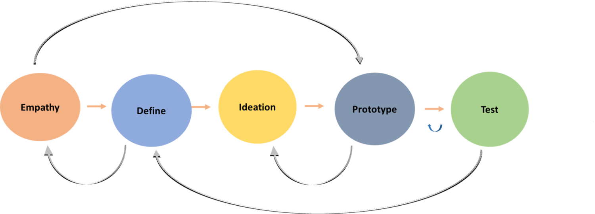

# DESIGN THINKING (TƯ DUY THIẾT KẾ)

Nhóm: N005

- 16521206 - Phạm Ngọc Phúc Thuần
- 17520943 - Trần Nguyễn Hồng Quân
- 17520964 - Nguyễn Đình Quyết

---
## 1. Định nghĩa 

**Design Thinking (Tư duy thiết kế)** là một quá trình giải quyết thực tế sáng tạo,của các vấn đề hoặc các vấn đề để tìm kiếm một kết quả trong tương lai được cải thiện. Đó là khả năng cần thiết để kết hợp sự đồng cảm, sáng tạo và tính hợp lý để đáp ứng nhu cầu người sử dụng và kinh doanh thành công.

## 2. Vì sao cần đến Tư duy Thiết kế?

- Sự phức tạp của vấn đề ngày càng gia tăng.
- Sự không chắn chắc càng gia tăng khi có sự thay đổi chóng mặt từ xã hội, công nghệ, hành vi người tiêu dùng...
- Vai trò quan trọng của trải nghiệm khách hàng.
- Vai trò quan trọng của đổi mới sáng tạo (**innovation**) trong thế giới cạnh tranh. 

## 4. Quá trình 5 bước

- Bước 1: Empathy - Thấu hiểu 

> Đặt bản thân vào vị trí của người dùng để hiểu vấn đề cần giải quyết, thường là thông qua việc nghiên cứu người dùng.   

- Bước 2: Define - Xác định vấn đề

> Phân tích những thông tin đã thu nhập từ nghiên cứu để xác định vấn đề cốt lõi.

- Bước 3: Ideation - Xây dựng ý tưởng 

> Lên ý tưởng trên giấy để tạo ra giải pháp/sản phẩm giải quyết vấn đề đã xác định. 

- Bước 4: Prototype - Quá trình dựng mẫu

> Mục đích là xác định giải pháp/sản phẩm tốt nhất cho vấn đề từ những phiên bản mẫu thử nghiệm. 

- Bước 5: Test - Thử nghiệm 

> Quay lại các bước trước để thay đổi và cải tiến thêm giải pháp/sản phẩm.