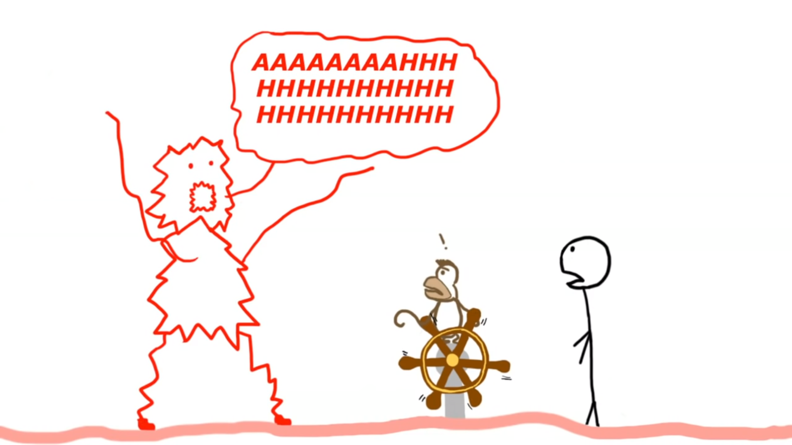

# READING - WRITING: INSIDE THE MIND OF A MASTER PROCRASTINATOR | TIM URBAN

> Hãy xem đoạn video của Tim Urban trong link đính kèm và viết lại theo cấu trúc sau:
>
> 1. Vấn đề đặt ra trong bài nói chuyện là gì? Tại sao lại cần quan tâm đến vấn đề này
> 2. Giả thuyết đặt ra là gì? Mô tả các thành phần của giả thuyết
> 3. Cách giả thuyết giải thích/giải quyết vấn đề đặt ra là gì?
> 4. Các hệ quả là gì?

**Nhóm N005:**

- 16521206 - Phạm Ngọc Phúc Thuần
- 17520943 - Trần Nguyễn Hồng Quân
- 17520964 - Nguyễn Đình Quyết

---

## 1. Vấn đề đặt ra trong bài nói chuyện là gì? Tại sao lại cần quan tâm đến vấn đề này

Vấn đề đặt ra: Bộ não của người thường xuyên trì hoãn.

Lý do cần quan tâm đến vấn đề này: Sự ảnh hưởng của việc trì hoãn đến cuộc sống của từng người.

## 2. Giả thuyết đặt ra là gì? Mô tả các thành phần của giả thuyết

Bộ não của người có thói quen trì hoãn có 3 "nhân vật" chính và có những đặc điểm sau:

- **_Người Quyết định theo Lý lẽ_**: tính toán, lên kế hoạch và quyết định cho những việc làm ở thời điểm hiện tại và tương lai;
- **_Chú khỉ Vui vẻ thoáng qua_**: thích những thứ "easy" (dễ dàng) và "fun" (vui), và sợ duy nhất Quái vật Hoảng sợ;
- **_Quái vật Hoảng sợ_**: là "thiên thần hộ mệnh" của Người Quyết định theo Lý lẽ, giúp nhân vật này lấy lại quyền quyết định và kiểm soát tình hình.

_Nguồn: https://www.youtube.com/watch?v=arj7oStGLkU&feature=emb_logo_

## 3. Cách giả thuyết giải thích/giải quyết vấn đề đặt ra là gì?

Cách hoạt động của 3 "nhân vật" trên như sau:

> - Một dự án có thời hạn được đưa ra, Người Quyết định theo Lý lẽ lên kế hoạch để thực hiện.
> - Chú khỉ Vui vẻ xuất hiện và đánh lạc hướng bộ não để thực hiện những việc "easy & fun" nằm ngoài dự án.
> - Khi thời gian thực hiện gần hết hoặc tình hình trở nên nghiêm trọng, Quái vật Hoảng sợ tỉnh dậy và đuổi Chú khỉ đi.
> - Người Quyết định theo Lý lẽ lấy lại quyền kiểm soát và thực hiện để hoàn thành dự án trong thời gian ngắn còn lại.

## 4. Các hệ quả là gì?

Theo diễn giả Tim Urban đề cập, các đặc điểm của những người gửi mail phản hồi, đây cũng là hệ quả của vấn đề này:

- Trạng thái tiêu cực và khả năng stress cao;
- Thất vọng và đau khổ về việc trì hoãn các quyết định trong quá khứ;
- Đối với các dự án/vấn đề không thời hạn, sự trì hoãn kéo dài gần như mãi mãi.
