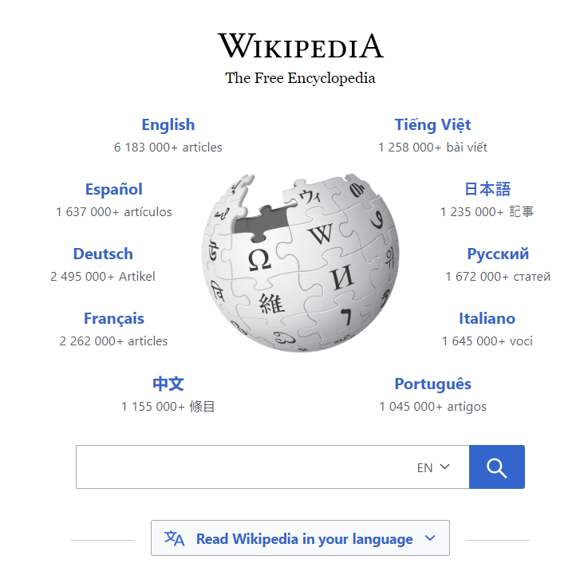
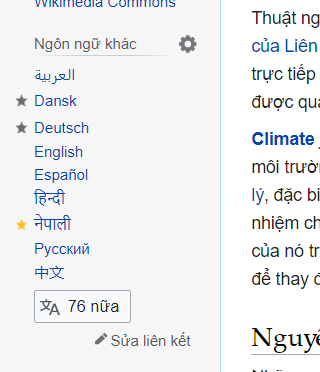

# QT- SEARCH03: THỰC HÀNH TÌM KIẾM
> Hãy cho biết một số ví dụ minh hoạ khi dùng các sites sau (tối thiểu 2 sites):
> - Quora
> - Google Scholar
> - ResearchGate 
> - Connected Papers
> - Wikipedia

**Nhóm N005:**
- 16521206 - Phạm Ngọc Phúc Thuần
- 17520943 - Trần Nguyễn Hồng Quân
- 17520964 - Nguyễn Đình Quyết
---
## 1. ResearchGate
***Trang chủ:** https://www.researchgate.net/*

ResearchGate là một mạng xã hội dành cho nhà khoa học và nhà nghiên cứu để chia sẻ các dự án và nghiên cứu, đồng thời có thể đặt câu hỏi và trả lời câu hỏi, hoặc tìm kiếm người để cộng tác. Bộ lọc cụ thể và đa dạng giúp người dùng dễ dàng tìm kiếm hơn:

| Bộ lọc | Điều kiện | Giải thích |
|--|--|--|
|Researchers|Đăng nhập|Những nhà khoa học và nghiên cứu liên quan đến câu truy vấn hoặc lĩnh vực tìm kiếm
|Projects|Đăng nhập|Những dự án chưa được công bố rộng rãi liên quan đến câu truy vấn hoặc lĩnh vực tìm kiếm
|Publicaions| |Những dự án hoặc nghiên cứu được công bố rộng rãi liên quan đến câu truy vấn hoặc lĩnh vực tìm kiếm
|Questions| |Những câu hỏi và trả lời có liên quan đến câu truy vấn hoặc lĩnh vực tìm kiếm
|Jobs|Đăng nhập|Những dự án hoặc nghiên cứu cần tìm kiếm người cộng tác
|Instutions|Đăng nhập|Thường là trường Đại học hoặc Cao đẳng có ngành nghề thuộc lĩnh vực tìm kiếm, hoặc có nhóm nghiên cứu và dự án liên quan đến câu truy vấn
|Departments|Đăng nhập|Những tổ chức khoa học và nghiên cứu liên quan đến câu truy vấn hoặc lĩnh vực tìm kiếm
|Authors||Tác giả của bài viết, dự án liên quan đến câu truy vấn hoặc lĩnh vực tìm kiếm

Ví dụ, người dùng muốn tìm kiếm những bài viết liên quan đến "Biến đổi khí hậu" (tiếng Anh là "Climate change"). Các bước thực hiện tìm kiếm như sau:
- Bước 1: Truy cập vào trang chủ của ResearchGate
- Bước 2: Nhập câu truy vấn vào thanh tìm kiếm: Climate Change
> Lưu ý: ResearchGate là một site quốc tế, nên việc tìm kiếm bằng tiếng Anh cung cấp nhiều kết quả có liên quan hơn.
- Bước 3: Nhấn Enter hoặc nhấp vào icon kính lúp để bắt đầu tìm kiếm
- Bước 4: Lựa chọn kết quả tìm kiếm để thu nhập các thông tin cần thiết

## 2. Wikipedia
***Trang chủ:** https://www.wikipedia.org/*

Wikipedia là một bách khoa toàn thư trực tuyến với mục đích phi lợi nhuận.

Tương tự như ví dụ trên, người dùng thực hiện các bước sau để tìm kiếm:
- Bước 1: Truy cập vào trang chủ của Wikipedia
- Bước 2: Nhập câu truy vấn vào thanh tìm kiếm và chọn ngôn ngữ mà bài viết thể hiện. Câu truy vấn là "Biến đổi khí hậu" và ngôn ngữ là tiếng Việt - VI
- Bước 3: Nhấn Enter hoặc nhấp vào icon kính lúp để bắt đầu tìm kiếm

Kết quả trả về: https://vi.wikipedia.org/wiki/Bi%E1%BA%BFn_%C4%91%E1%BB%95i_kh%C3%AD_h%E1%BA%ADu

Để thay đổi ngôn ngữ thể hiện bài viết, người dùng có thể nhấp vào ngôn ngữ muốn chọn. 

 