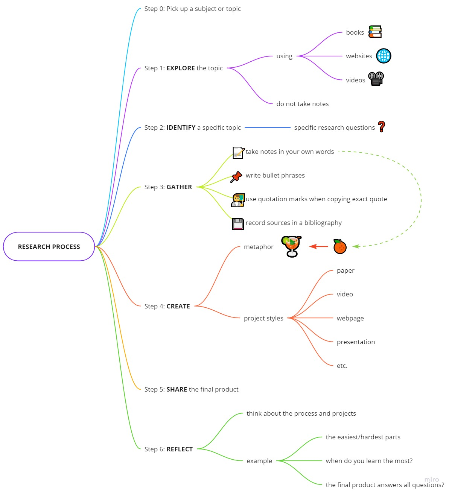

# STEPS OF RESEARCH PROCESS

Nhóm: N005
- 16521206 - Phạm Ngọc Phúc Thuần
- 17520943 - Trần Nguyễn Hồng Quân
- 17520964 - Nguyễn Đình Quyết

---
## 1. Viết tóm tắt (dạng summary/abstract) về nội dung của video.

## 2. Trong 6 bước trên - theo bạn bước nào mà bạn nghĩ là khó nhất?

Bước khó nhất là bước 2, việc xác định một chính xác chủ đề/vấn đề ***hẹp*** mà bản thân muốn nghiên cứu.

Bởi vì, một chủ đề mở (được giao ở bước 0) có thể có rất nhiều hướng nghiên cứu, đồng nghĩa với việc tìm hiểu các hướng đó (bước 11). Việc này không chỉ tốn thời gian ở việc tìm hiểu, người làm nghiên cứu còn sẽ gặp khó khăn trong việc lựa chọn chủ đề phù hợp với sở thích, năng lực, thời gian, và các yếu tố cá nhân khác.  